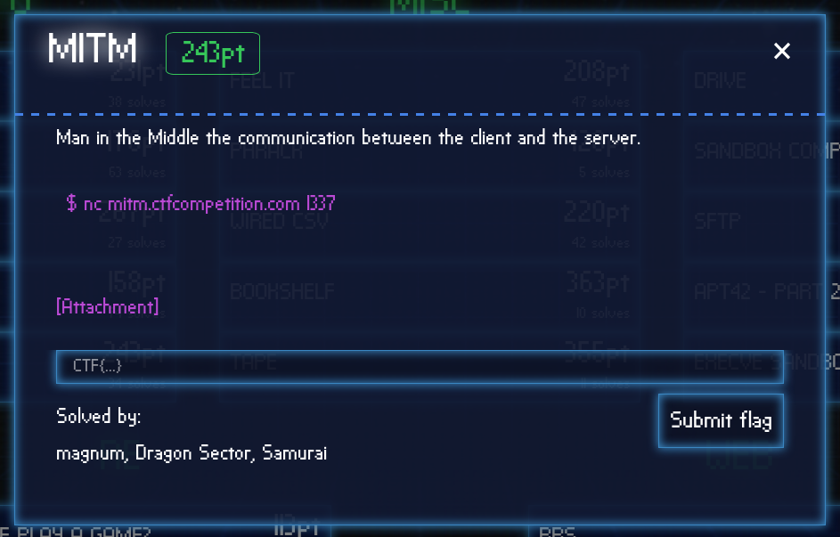

Google CTF 2018 MITM Challenge
==============================

# tl;dr

We need to crack a DH-based protocol that allows for so called "contributory behaviour". Thus we can use one of the [32-byte values for Curve25519](http://cr.yp.to/ecdh.html#validate) that will make MITM-keys equal. The protocol was actually discussed in Thai Duong's blog [several](https://vnhacker.blogspot.com/2016/08/the-internet-of-broken-protocols.html) [times](https://vnhacker.blogspot.com/2015/09/why-not-validating-curve25519-public.html) and shows, that in some cases public keys for Curve25519 must be validated.

# the challenge



The organisers provided us with a network endpoint and an archive with code. The app can work as either server or client depending on the first network message.
 
```python
    server_or_client = ReadLine(reader)
    is_server = server_or_client[0] in b'sS'
    is_client = server_or_client[0] in b'cC'
```

Client and server run a Diffie-Hellman based protocol to get a shared key and perform mutual auhentication using a pre shared secret (PSS) like it's depicted on the following scheme:

[The handshake](handshake.png)

And how it looks in code:

```python
def Handshake(password, reader, writer):
    myPrivateKey = Private()
    myNonce = os.urandom(32)

    WriteBin(writer, myPrivateKey.get_public().serialize())
    WriteBin(writer, myNonce)

    theirPublicKey = ReadBin(reader)
    theirNonce = ReadBin(reader)

    if myNonce == theirNonce:
        return None
    if theirPublicKey in (b'\x00'*32, b'\x01' + (b'\x00' * 31)):
        return None

    theirPublicKey = Public(theirPublicKey)

    sharedKey = myPrivateKey.get_shared_key(theirPublicKey)
    myProof = ComputeProof(sharedKey, theirNonce + password)

    WriteBin(writer, myProof)
    theirProof = ReadBin(reader)

    if not VerifyProof(sharedKey, myNonce + password, theirProof):
        return None

    return sharedKey
```

The proof is computed as follows:

```python
def ComputeProof(key, data):
    return hmac.new(key, data, digestmod=hashlib.sha256).digest()
```
```python
def VerifyProof(key, data, proof):
    return hmac.compare_digest(ComputeProof(key, data), proof)
```

where ```key``` is a shared key computed during the DH-dance and the ```data``` parameter is ```nonce + password```. 

To get the flag we need to send an encrypted message ```b'getflag'``` to the server.

# Observations

As we can see from the handshake code:

1. There's no way to leak the password (PSS) as it's used only as a parameter of HMAC.

2. Server checks whether his nonce equals to the client's nonce, so we can't impersonate the client and replay the server's nonce and server's proof back to the server.

3. The public key is checked for being not in ```(b'\x00'*32, b'\x01' + (b'\x00' * 31))```

So as we can't leak the PSS, probably we don't need it and we can try to subvert the protocol. If we perfrom a MITM attack and make the keys equal for the both MITM sides, then we don't need to know the PSS and we can pass the client's proof to the server and we'll be authenticated. So all in all:
 
 1. We need to have the same key for the both sides during MITM
 2. We need to know the MITM key
 
The public key check looks "weak" so we can look for some more values for it. I found some on [djb's web site](http://cr.yp.to/ecdh.html#validate), picked the following one:

```python
325606250916557431795983626356110631294008115727848805560023387167927233504
```

and carried out some experiments:

```python
from curve25519 import Private, Public
from binascii import hexlify

keys = set()

for i in range(30):
    myPrivate = Private()
    val = int.to_bytes(325606250916557431795983626356110631294008115727848805560023387167927233504, 32, 'little')
    theirPublic = Public(val)
    shared = myPrivate.get_shared_key(theirPublic)
    print(hexlify(shared))
    keys.add(shared)

print("[~] Num of different keys: {}".format(len(keys)))
```

The test showed that the shared key doesn't depend on the private key values (they're fresh for each iteration), so we can carry out the attack.

# The attack

```python
#!/usr/bin/env python3

from curve25519 import Public
import nacl.secret
import socket
import binascii

socket_server = ("mitm.ctfcompetition.com", 1337)
public_key_val = Public(int.to_bytes(325606250916557431795983626356110631294008115727848805560023387167927233504, 32, 'little'))
shared_key = binascii.unhexlify(b'68b59f127c671255346e099c3b9ea067a5595ba2adf26daa5e69d6a8a29d191a')


def make_sockets():
    server = socket.socket(socket.AF_INET, socket.SOCK_STREAM)
    server.connect(socket_server)

    client = socket.socket(socket.AF_INET, socket.SOCK_STREAM)
    client.connect(socket_server)

    return server, client


def attack():
    s, c = make_sockets()
    s.send(b's\n')
    c.send(b'c\n')

    server_pub = s.recv(4096)[:-1]
    print(server_pub.decode())
    server_nonce = s.recv(4096)[:-1]
    print(server_nonce.decode())

    client_pub = c.recv(4096)[:-1]
    print(client_pub.decode())
    client_nonce = c.recv(4096)[:-1]
    print(client_nonce.decode())

    s.send(binascii.hexlify(public_key_val.serialize()) + b'\n')
    s.send(client_nonce + b'\n')

    c.send(binascii.hexlify(public_key_val.serialize()) + b'\n')
    c.send(server_nonce + b'\n')

    server_proof = s.recv(4096)[:-1]
    client_proof = c.recv(4096)[:-1]

    # send server's proof to the client
    c.send(server_proof + b'\n')

    # send client's proof to the server
    s.send(client_proof + b'\n')

    # close client socket
    c.close()

    # read auth string
    auth_string = s.recv(4096)[:-1]

    box = nacl.secret.SecretBox(shared_key)
    data = box.decrypt(binascii.unhexlify(auth_string))
    if data == b'AUTHENTICATED':
        print("[~] Got AUTHENTICATED")

    get_flag_cmd = b"getflag"
    encrypted_cmd = box.encrypt(get_flag_cmd)

    s.send(binascii.hexlify(encrypted_cmd) + b'\n')
    encrypted_flag = s.recv(4096)[:-1]

    data = box.decrypt(binascii.unhexlify(encrypted_flag))
    print("[~] The flag is {}".format(data.decode()))


if __name__ == "__main__":
    attack()

```

In the code above I used the shared key I got during the experiment. The code just uses the 32-byte value that produces the mentioned shared key and passes client's nonce and proof to the server. Then it encryps ```b'getflag'``` using the shared key and reads the frag from the server. 


```python
python solution.py
9e5a8f40824b36adad9505050cfb89eccd94c3c19226b735dd8f862736387e77
26c206bebc1fbb6ebf018588476854c401f1bb594399f3aff661bc65f631cadf
2dc4548ab69d7906023d1dd3db080da88304b08fd8c989e5ead9f39a93802e0a
87a32b8304af3c1225b7c1b78ec0b0759710c98a3790b75c01312b8b3a5ad140
[~] Got AUTHENTICATED
b'CTF{kae3eebav8Ac7Mi0RKgh6eeLisuut9oP}'

Process finished with exit code 0
```

# Some takeaways and conclusions

* If the protocol allows for so called "contributory behaviour", Curve25519 public keys must be either validated or another [mitigation](https://vnhacker.blogspot.com/2015/09/why-not-validating-curve25519-public.html) must be applied.

* There's an [interesting](https://research.kudelskisecurity.com/2017/04/25/should-ecdh-keys-be-validated/) [discussion](https://moderncrypto.org/mail-archive/curves/2017/000896.html) whether Curve25519 public keys should be validated. 

* The Thai Duong's [The Internet of Broken Protocols](https://vnhacker.blogspot.com/search/label/The%20Internet%20of%20Broken%20Protocols) series of posts are worth reading :)